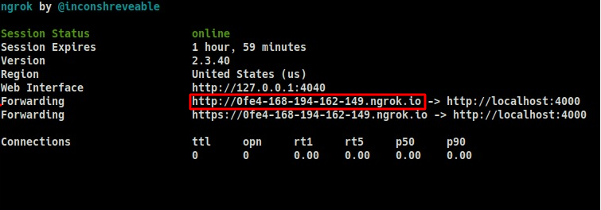

# Webhook listener

## Using:

- Ruby 3.0.1
- Rails 6.1.4
- [Ngrok](https://ngrok.com/)

## Download and Local installation

```sh
git clone https://github.com/axelzito/jaya-challenge.git project_name
```

```sh
cd project_name
```

```sh
bundle install
```

```sh
sudo -u postgres createuser -s $USER -P
rails db:create
```
> If the below step return any erro, try this:
>
> sudo -u postgres psql
> \password
>
> Set your password, and try again:
> 
> rails db:create

```sh
rails db:migrate
```

Configure you `.env` file
> cp .env.example .env

Install the ngrok dependence, it generates a public url that will route to your local host:
```sh
sudo snap install ngrok
```

```sh
sudo ngrok http 4000 
```

In your `config/environments/development.rb` file, add a line with the ngrok url



> config.hosts << 'xxxx-xxx-xxx-xxx-xxx.ngrok.io'

```sh
rails s -p 4000
```

## Running tests

To run the tests, just run the command:

```sh
rspec
```

## Production link:

This project running in Heroku with automatically deploys from master branch after pass in CI with Github Actions.
- https://jaya-challenge-axel.herokuapp.com/

To test, just create an issue or comment in existent issue in this repository.
- https://github.com/axelzito/jaya-challenge/issues

After that you can check just using Postman:

To return all issues, just run
> GET https://jaya-challenge-axel.herokuapp.com/api/issues/

```sh
[
    {
        "id": 1,
        "action": "created",
        "created_at": "2021-11-06T20:00:07.981Z",
        "updated_at": "2021-11-06T20:00:07.981Z"
    },
    {
        "id": 2,
        "action": "edited",
        "created_at": "2021-11-06T20:04:09.061Z",
        "updated_at": "2021-11-06T20:04:09.061Z"
    }
]
```

To return a specific issue, just run
> GET https://jaya-challenge-axel.herokuapp.com/api/issues/:id

To return a full event from a specific issues, just run
> GET https://jaya-challenge-axel.herokuapp.com/api/issues/:id/events

Is necessary to use Basic Authentication
```sh
Username: xxx
Password: xxx
```

by [Axel Miguez](https://github.com/axelzito)
